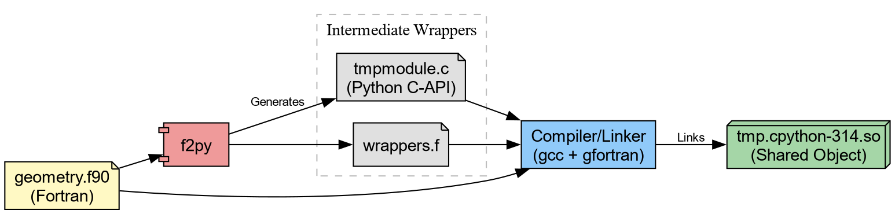
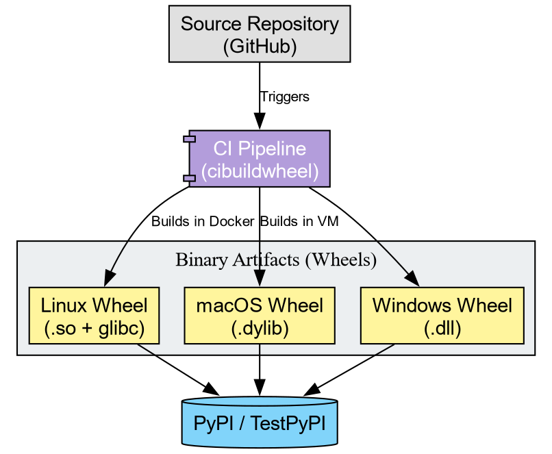

::: questions
-   How does the Python ecosystem deliver high-performance binaries to
    users?
-   What distinguishes a "Source Distribution" from a "Binary Wheel"?
-   What role does `cibuildwheel`{.verbatim} play in software
    distribution?
:::

::: objectives
-   Construct a Python extension module from a Fortran kernel using
    Meson.
-   Configure a build-backend for compiled extensions using
    `meson-python`{.verbatim}.
-   Setup a CI pipeline to generate binary wheels for distribution.
:::

## The Shared Object Reality

In the domain of scientific Python, "packaging" often refers effectively
to "binary distribution." When users install libraries such as
`numpy`{.verbatim}, `torch`{.verbatim}, or `openblas`{.verbatim}, they
typically download compiled artifacts rather than pure Python scripts.

Investigation of the `site-packages` directory reveals that the core
logic resides in **Shared Object** files (`.so` on Linux, `.dylib` on
macOS, `.dll` on Windows). Python functions primarily as the interface.

To distribute high-performance code effectively, one must master the
pipeline that generates these artifacts consisting of

Translation
:   Generating C wrappers for Fortran/C++ code.

Compilation
:   Transforming source code into shared objects.

Bundling
:   Packaging shared objects into Wheels (`.whl`).

```{=org}
#+RESULTS[7d9cff6afb9ca6283d98e4f2de3212a6711bfa6e]:
```


## The Computational Kernel in Fortran

We begin with a computational kernel. In physical chemistry, calculating
the Euclidean distance between atomic coordinates constitutes a
fundamental operation.

Create `src/chemlib/geometry.f90`{.verbatim}:

``` {.f90 tangle="data/chemlib/src/chemlib/geometry.f90"}
subroutine calc_distance(n, r_a, r_b, dist)
    implicit none
    integer, intent(in) :: n
    real(8), intent(in), dimension(n) :: r_a, r_b
    real(8), intent(out) :: dist

    !f2py intent(hide) :: n
    !f2py intent(in) :: r_a, r_b
    !f2py intent(out) :: dist

    integer :: i
    dist = 0.0d0
    do i = 1, n
        dist = dist + (r_a(i)-r_b(i))**2
    end do
    dist = sqrt(dist)
end subroutine calc_distance
```

This can be immediately compiled through `f2py`.

``` bash
cd src/chemlib/
uv run f2py -c geometry.f90 -m tmp
```

Which generates `tmp.cpython*.so` (or `.dll` on Windows). We can try
this out.

``` python
❯ python
Python 3.14.2 (main, Jan  2 2026, 14:27:39) [GCC 15.2.1 20251112] on linux
Type "help", "copyright", "credits" or "license" for more information.
>>> import tmp
>>> tmp.calc_distance([0.,0.,0.], [1.,1.,1.])
1.7320508075688772
```

::: challenge
## Challenge: Validate the result

Can you make sure the results are correct? Note that since we cannot
really "install" the package yet, a simple `assert`{.verbatim} will have
to do.

::: solution
``` python
import numpy as np
import tmp
fort_result=tmp.calc_distance([0.,0.,0.], [1.,1.,1.])
np_base = np.linalg.norm(np.asarray([0,0,0])-np.asarray([1,1,1]))
np.float64(1.7320508075688772)
assert(np_base==fort_result)
```
:::
:::

## Considering "installable" variants with `meson`

The **problem** with the setup so far is that the compiled extension
doesn't get "installed" into `site-packages`{.verbatim}. To work around
this, it helps to first take a look behind the curtain. `f2py` with the
`--build-dir` option will output the intermediate build files.

``` bash
cd src/chemlib
uv run f2py -c geometry.f90 -m tmp --build-dir tmp_out
```

::: spoiler
### Build output

```{=org}
#+RESULTS[20faf83b1c6e3a245d6a8c4d9a9142afc5f8c878]:
```
``` bash
❯ f2py -c geometry.f90 -m tmp --build-dir tmp_out
Cannot use distutils backend with Python>=3.12, using meson backend instead.
Using meson backend
Will pass --lower to f2py
See https://numpy.org/doc/stable/f2py/buildtools/meson.html
Reading fortran codes...
    Reading file 'geometry.f90' (format:free)
Post-processing...
  character_backward_compatibility_hook
Post-processing (stage 2)...
Building modules...
    Building module "tmp"...
    Generating possibly empty wrappers"
    Maybe empty "tmp-f2pywrappers.f"
        Constructing wrapper function "calc_distance"...
          dist = calc_distance(r_a,r_b)
    Wrote C/API module "tmp" to file "./tmpmodule.c"
The Meson build system
Version: 1.10.1
Source dir: /home/rgoswami/Git/Github/epfl/pixi_envs/teaching/python_packaging_workbench/python_packaging_workbench/org_src/episodes/data/chemlib/src/chemlib/tmp_out
Build dir: /home/rgoswami/Git/Github/epfl/pixi_envs/teaching/python_packaging_workbench/python_packaging_workbench/org_src/episodes/data/chemlib/src/chemlib/tmp_out/bbdir
Build type: native build
Project name: tmp
Project version: 0.1
Fortran compiler for the host machine: gfortran (gcc 15.2.1 "GNU Fortran (GCC) 15.2.1 20260103")
Fortran linker for the host machine: gfortran ld.bfd 2.45.1
C compiler for the host machine: cc (gcc 15.2.1 "cc (GCC) 15.2.1 20260103")
C linker for the host machine: cc ld.bfd 2.45.1
Host machine cpu family: x86_64
Host machine cpu: x86_64
Program /usr/bin/python found: YES (/usr/bin/python)
Found pkg-config: YES (/usr/bin/pkg-config) 2.5.1
Build targets in project: 1

Found ninja-1.13.2 at /usr/bin/ninja
INFO: autodetecting backend as ninja                                    
INFO: calculating backend command to run: /usr/bin/ninja -C /home/rgoswami/Git/Github/epfl/pixi_envs/teaching/python_packaging_workbench/python_packaging_workbench/org_src/episodes/data/chemlib/src/chemlib/tmp_out/bbdir
ninja: Entering directory `/home/rgoswami/Git/Github/epfl/pixi_envs/teaching/python_packaging_workbench/python_packaging_workbench/org_src/episodes/data/chemlib/src/chemlib/tmp_out/bbdir'
[7/7] Linking target tmp.cpython-314-x86_64-linux-gnu.so
```
:::

Which we can then inspect..

``` bash
cd data/chemlib/src/chemlib
ls tmp_out
```

```{=org}
#+RESULTS[34549299827e23e98710f15aade665ec57200c08]:
```
``` bash
bbdir
geometry.f90
meson.build
tmp-f2pywrappers.f
tmpmodule.c
```

The intermediate involves a `meson.build` !

``` bash
cat data/chemlib/src/chemlib/tmp_out/meson.build 
```

::: spoiler
### Generated `meson.build`

```{=org}
#+RESULTS[73fb781ddafa8f4345dd79fe1901e69685c5721c]:
```
``` meson
project('tmp',
        ['c', 'fortran'],
        version : '0.1',
        meson_version: '>= 1.1.0',
        default_options : [
                            'warning_level=1',
                            'buildtype=release'
                          ])
fc = meson.get_compiler('fortran')

py = import('python').find_installation('''/usr/bin/python''', pure: false)
py_dep = py.dependency()

incdir_numpy = run_command(py,
  ['-c', 'import os; os.chdir(".."); import numpy; print(numpy.get_include())'],
  check : true
).stdout().strip()

incdir_f2py = run_command(py,
    ['-c', 'import os; os.chdir(".."); import numpy.f2py; print(numpy.f2py.get_include())'],
    check : true
).stdout().strip()

inc_np = include_directories(incdir_numpy)
np_dep = declare_dependency(include_directories: inc_np)

incdir_f2py = incdir_numpy / '..' / '..' / 'f2py' / 'src'
inc_f2py = include_directories(incdir_f2py)
fortranobject_c = incdir_f2py / 'fortranobject.c'

inc_np = include_directories(incdir_numpy, incdir_f2py)
# gh-25000
quadmath_dep = fc.find_library('quadmath', required: false)

py.extension_module('tmp',
                     [
                     '''geometry.f90''',
                     '''tmpmodule.c''',
                     '''tmp-f2pywrappers.f''',
                     fortranobject_c
                     ],
                     include_directories: [
                     inc_np,
                     ],
                     objects: [
                     ],
                     dependencies : [
                     py_dep,
                     quadmath_dep,
                     ],
                     install : true)
```
:::

We could take inspiration from this, generate sources, and link them
together:

``` meson
f2py_prog = find_program('f2py')
# Generate Wrappers
geometry_source = custom_target('geometrymodule.c',
  input : ['src/chemlib/geometry.f90'],
  output : ['geometrymodule.c', 'geometry-f2pywrappers.f'],
  command : [f2py_prog, '-m', 'geometry', '@INPUT@', '--build-dir', '@OUTDIR@']
)
```

A pattern commonly used in SciPy for instance. Here we will consider a
less tool-heavy approach though build backends such as
`meson-python`{.verbatim}, `scikit-build-core`{.verbatim}, and
`setuptools`{.verbatim} orchestrate complex builds.

### The "Manual" Install

For now, let's consider falling back to what we learned about
installation.

::: challenge
## Challenge: The Site-Packages Hack

Your goal: Make the `tmp` module importable from anywhere in your system
(within the current environment), not just the source folder.

Locate the active `site-packages` directory for your current
environment.

Copy the compiled `.so` (or `.pyd`) file into that directory.

Change your directory to `$HOME` (to ensure you do not import the local
file).

Launch Python and attempt to `import tmp`.

::: hint
Hint: You can find the install location using:

``` bash
uv run python -c "import site; print(site.getsitepackages()[0])"
```
:::

::: solution
``` bash

1. Get the path
SITE_PACKAGES=$(uv run python -c "import site; print(site.getsitepackages()[0])")

2. Copy the artifact
cp src/chemlib/tmp.cpython*.so "$SITE_PACKAGES/"

3. Move away and test
cd ~ uv run python -c "import tmp; print(tmp.calc_distance([0,0,0], [1,1,1]))"
```
:::
:::

This manual exercise mimics exactly how libraries like
`openblas`{.verbatim}, `metatensor`{.verbatim}, and `torch`{.verbatim}
operate. If you examine their installed folders, you will find large
compiled shared objects.

The Python files (`__init__.py`{.verbatim}) serve mostly as wrappers to
load these binary blobs. For example, a robust package might look like
this:

``` python
try:
    from . import _geometry_backend
except ImportError:  # Logic to handle missing binaries or wrong platforms
    raise ImportError("Could not load the compiled extension!")


def calc_distance(a, b):  # Pure Python type checking before passing to Fortran
    return _geometry_backend.calc_distance(a, b)
```

## The Wheelhouse

We now possess a working shared object. However, a critical flaw
remains: **Portability**.

The `.so` file you just generated links against:

-   The specific version of Python on your machine.
-   The system C library (glibc) on your machine.
-   The CPU architecture (x86~64~, ARM64) of your machine.

If you email this file to a colleague running Windows, or even a
different version of Linux, it will crash.

To distribute this code, we cannot ask every user to install a Fortran
compiler and run `f2py`. Instead, we use `cibuildwheel` to distribute
binaries to end users.

A "Wheel" (`.whl`) functions as a ZIP archive containing the artifacts
we just manually moved. To support the community, we must generate
wheels for every combination of:

-   Operating System (Windows, macOS, Linux)
-   Python Version (3.10, 3.11, 3.12, 3.13, 3.14)
-   Architecture (x86, ARM)

Tools like `cibuildwheel` automate this matrix. They spin up isolated
environments (often using Docker or virtual machines), compile the code,
fix the library linkages (bundling dependencies), and produce the final
artifacts.

```{=org}
#+RESULTS[1061dd6a825e3f5e97fb9e7207014d5007c76398]:
```


::: challenge
## Challenge: Conceptualizing the Pipeline

Imagine you publish `chemlib`. A user reports:

"ImportError: DLL load failed: The specified module could not be found."

Based on today's lesson, what likely went wrong?

1.  The Python code has a syntax error.
2.  The user's computer lacks a Fortran compiler.
3.  The specific shared object for their OS/Python version was missing
    or incompatible.

::: solution
Answer: 3.

The error "DLL load failed" implies the Python interpreter attempted to
load the shared object but failed. This usually occurs when the binary
wheel does not match the user's system, or the wheel failed to bundle a
required system library. The user does not need a compiler (Option 2) if
they are using a Wheel.
:::
:::

### The Manylinux Standard

On Linux, binary compatibility presents a challenge due to varying
system libraries (glibc). `cibuildwheel` addresses this by executing the
build inside a specialized Docker container (Manylinux). This ensures
the compiled `.so` file links against an older version of glibc,
guaranteeing functionality on the majority of Linux distributions.

::: challenge
## Challenge: Inspecting an Artifact

1.  Go to the PyPI page for `metatomic`.
2.  You will observe a file ending in `.whl`.
3.  Treat this file as a ZIP archive (which it represents). Unzip it.
4.  Locate the `.so` (or `.pyd`) file inside.

**Reflection:** This binary file constitutes the actual product consumed
by users. The Fortran source code effectively disappears, becoming baked
into the machine code of this shared object.
:::

::: keypoints
-   **Shared Objects:** Scientific Python packages function primarily as
    delivery mechanisms for compiled binaries (`.so` files).
-   **Installation**: "Installing" a package physically amounts to
    copying these binaries into site-packages.
-   **Cibuildwheel:** Automates the creation of binary wheels for all
    platforms, removing the need for users to possess compilers.
:::
