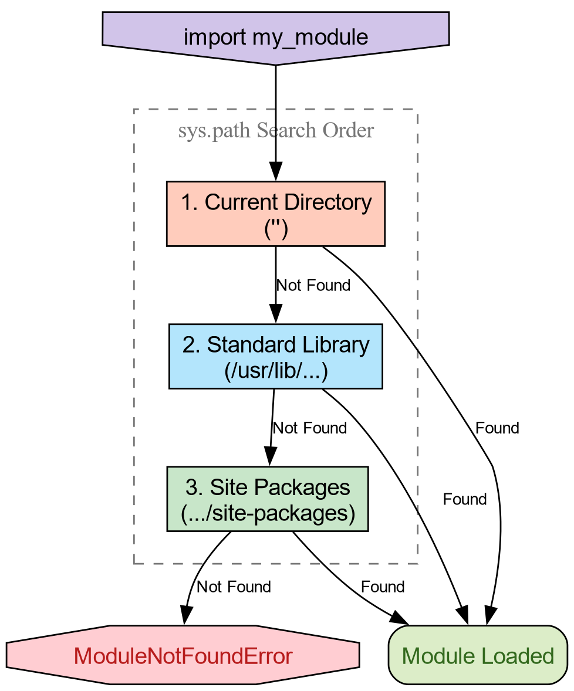
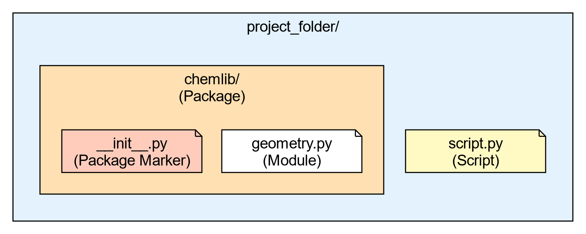

::: questions
-   How does Python know where to find the libraries you import?
-   What distinguishes a python "script" from a python "package"?
-   What is an `__init__.py`{.verbatim} file?
:::

::: objectives
-   Inspect the `sys.path`{.verbatim} variable to understand import
    resolution.
-   Differentiate between built-in modules, installed packages, and
    local code.
-   Create a minimal local package structure.
:::

## From Scripts to Reusable Code

You have likely written Python scripts before: single files ending in
`.py`{.verbatim} that perform a specific analysis or task. While scripts
are excellent for **execution** (running a calculation once), they are
often poor at facilitating **reuse**.

Imagine you wrote a useful function to calculate the center of mass of a
molecule in `analysis.py`{.verbatim}. A month later, you start a new
project and need that same function. You have two options:

1.  **Copy and Paste:** You copy the function into your new script.
    -   **Problem:** If you find a bug in the original function, you
        have to remember to fix it in every copy you made.
2.  **Importing:** You tell Python to load the code from the original
    file.

Option 2 is the foundation of Python packaging. To do this effectively,
we must first understand how Python finds the code you ask for.

## How Python Finds Code

When you type `import numpy`{.verbatim}, Python does not magically know
where that code lives. It follows a deterministic search procedure. We
can see this procedure in action using the built-in `sys`{.verbatim}
module.

``` python
import sys
from pprint import pprint

pprint(sys.path)
```

```{=org}
#+RESULTS[9928dfd935ff441f9112b0f45ebc8affdd7148b9]:
```
``` python
['',
 '/usr/lib/python314.zip',
 '/usr/lib/python3.14',
 '/usr/lib/python3.14/lib-dynload',
 '/usr/lib/python3.14/site-packages']
```

The variable `sys.path`{.verbatim} is a list of directory strings. When
you import a module, Python scans these directories **in order**. The
first match wins.

1.  **The Empty String ('')**: This represents the **current working
    directory**. This is why you can always import a
    `helper.py`{.verbatim} file if it is sitting right next to your
    script.
2.  **Standard Library**: Locations like `/usr/lib/python3.*`{.verbatim}
    contain built-ins like `os`{.verbatim}, `math`{.verbatim}, and
    `pathlib`{.verbatim}.
3.  **Site Packages**: Directories like `site-packages`{.verbatim} or
    `dist-packages`{.verbatim} are where tools like `pip`{.verbatim},
    `conda`{.verbatim}, or `pixi`{.verbatim} place third-party
    libraries.

::: challenge
## Challenge: Shadowing the Standard Library

What happens if you create a file named `math.py`{.verbatim} in your
current folder with the following content:

``` python
# math.py
print("This is my math!")
def sqrt(x):
    return "No square roots here."
```

And then run python and type `import math`{.verbatim}?

::: solution
Python will import **your** local file instead of the standard library
`math`{.verbatim} module.

**Why?** Because the current working directory (represented by
`''`{.verbatim} in `sys.path`{.verbatim}) is usually at the top of the
list. It finds your `math.py`{.verbatim} before scanning the standard
library paths. This is called "Shadowing" and is a common source of
bugs!
:::
:::

```{=org}
#+RESULTS[b89543340c8059dcec6d74851cfb6cbdb6791a7b]:
```


## The Anatomy of a Package

A **Module**
:   Is simply a single file ending in `.py`{.verbatim}.

A **Package**
:   Is a directory containing modules and a special file:
    `__init__.py`{.verbatim}.

Let's create a very simple local package to handle some basic chemistry
geometry. We will call it `chemlib`{.verbatim}.

``` bash
mkdir chemlib
touch chemlib/__init__.py
```

Now, create a module inside this directory called
`geometry.py`{.verbatim}:

    def center_of_mass(atoms):
        print("Calculating Center of Mass...")
        return [0.0, 0.0, 0.0]

Your directory structure should look like this:

``` text
project_folder/
├── script.py
└── chemlib/
    ├── __init__.py
    └── geometry.py
```

## The Role of `__init__.py`{.verbatim}

The `__init__.py`{.verbatim} file tells Python: "Treat this directory as
a package." It is the first file executed when you import the package.
It can be empty, but it is often used to expose functions to the top
level.

Open \`chemlib/\_~init~\_\_.py\` and add:

``` python
print("Loading chemlib package...")
from .geometry import center_of_mass
```

Now, from the `project_folder`{.verbatim} (the parent directory), launch
Python:

``` python
import chemlib

chemlib.center_of_mass([])
```

``` example
Loading chemlib package...
Calculating Center of Mass...
[0.0, 0.0, 0.0]
```

## The "It Works on My Machine" Problem

We have created a package, but it is fragile. It relies entirely on the
**Current Working Directory** being in `sys.path`{.verbatim}.

::: challenge
## Challenge: Moving Directories

1.  Exit your python session.
2.  Change your directory to go one level up (outside your project
    folder): `cd ..`{.verbatim}
3.  Start Python and try to run `import chemlib`{.verbatim}.

What happens and why?

::: solution
**Output:**

``` example
ModuleNotFoundError: No module named 'chemlib'
```

**Reason:** You moved out of the folder containing `chemlib`{.verbatim}.
Since the package is not installed in the global
`site-packages`{.verbatim}, and the current directory no longer contains
it, Python's search through `sys.path`{.verbatim} fails to find it.
:::
:::

```{=org}
#+RESULTS[831658e66470ba62e7d469f8cf9e2d99fd7f8258]:
```


To solve this, we need a standard way to tell Python "This package
exists, please add it to your search path permanently." This is the job
of **Packaging** and **Installation**.

::: keypoints
-   `sys.path`{.verbatim} is the list of directories Python searches for
    imports.
-   The order of search is: Current Directory -\> Standard Library -\>
    Installed Packages.
-   A **Package** is a directory containing an `__init__.py`{.verbatim}
    file.
-   Code that works locally because of the current directory will fail
    when shared unless properly installed.
:::
