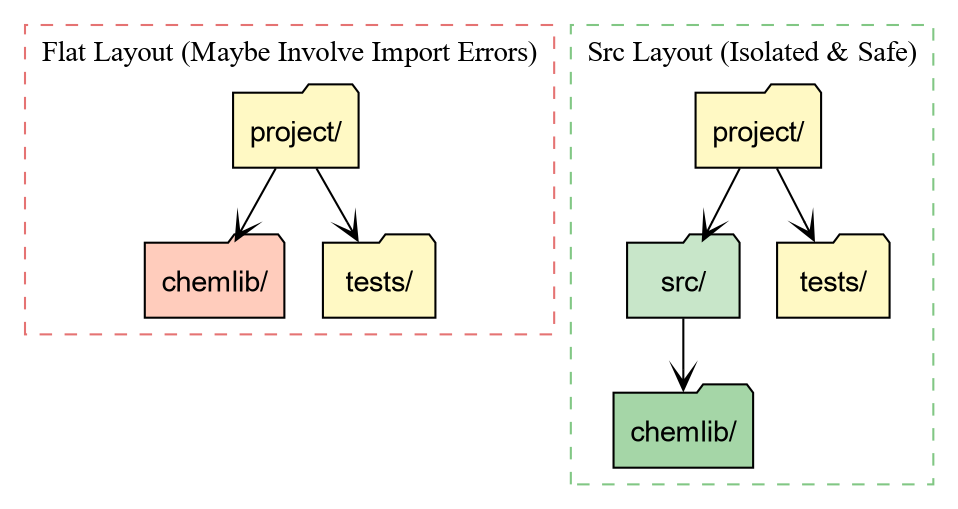
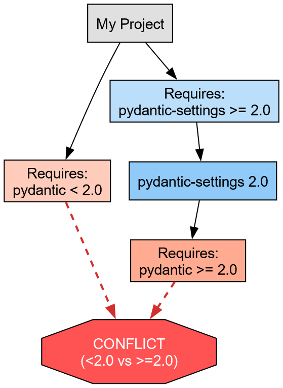

::: questions
-   How do I turn my folder of code into an installable library?
-   What is `pyproject.toml`{.verbatim} and why is it the standard?
-   How does `uv`{.verbatim} simplify project management?
-   Why use the `src`{.verbatim} layout?
:::

::: objectives
-   Use `uv init`{.verbatim} to generate a standard
    `pyproject.toml`{.verbatim} (PEP 621).
-   Organize code using the `src`{.verbatim} layout to prevent import
    errors.
-   Manage dependencies and lockfiles using `uv add`{.verbatim}.
-   Run code in an isolated environment using `uv run`{.verbatim}.
:::

## The Installation Problem {#the-installation-problem id="7ea4dd6f-c2c2-4756-9202-f6f0c2f21bbe"}

In the previous episode, we hit a wall: our `chemlib`{.verbatim} package
only worked when the interpreter starts from the project folder. To fix
this, we need to **Install** the package into our Python environment.

As far as Python is concerned, an "installation" involves placing the
files somewhere the interpreter will find them. One of the simplest ways
involves setting the `PYTHONPATH`{.verbatim} terminal variable.

 and [Goswami PyCon 2020](https://rgoswami.me/posts/pycon-in-2020-meta) presentation](fig/The_Installation_Problem/2026-02-11_06-21-53_screenshot.png)

::: callout
::: spoiler
### The Packaging Timeline

An annotated timeline of tooling:

2003
:   [PEP 301](https://peps.python.org/pep-0301/) defines PyPI

2004
:   `setuptools`{.verbatim} declares dependencies

2005
:   packages are hosted on PyPI

2007
:   `virtualenv`{.verbatim} is released to support multiple Python
    versions

2008
:   `pip`{.verbatim} is released for better dependency management

2012
:   multi-language distribution discussions from [PEP
    425](https://peps.python.org/pep-0425/) and [PEP
    427](https://peps.python.org/pep-0427/) [^1]

2013
:   [PEP 427](https://peps.python.org/pep-0427/) standardizes the
    `wheel`{.verbatim} format, replacing eggs

2016
:   [PEP 518](https://peps.python.org/pep-0518/) introduces
    `pyproject.toml`{.verbatim} to specify build dependencies [^2]

2017
:   [PEP 517](https://peps.python.org/pep-0517/) separates the build
    frontend (`pip`{.verbatim}) from the backend (`flit`{.verbatim},
    `hatch`{.verbatim}, `poetry`{.verbatim})

2020
:   [PEP 621](https://peps.python.org/pep-0621/) standardizes project
    metadata in `pyproject.toml`{.verbatim}, removing the need for
    `setup.py`{.verbatim} configuration

2022
:   [PEP 668](https://peps.python.org/pep-0668/) marks system Python
    environments as "externally managed" to prevent accidental breakage

2021
:   [PEP 665](https://peps.python.org/pep-0665/) attempts (and fails) to
    standardize lockfiles. [^3]

2024
:   [PEP 723](https://peps.python.org/pep-0723/) enables inline script
    metadata. [^4]

2024
:   [PEP 735](https://peps.python.org/pep-0735/) introduces dependency
    groups (e.g., separating `test`{.verbatim} or `lint`{.verbatim}
    dependencies) without requiring a package build.

2025
:   [PEP 751](https://peps.python.org/pep-0751/) formalizes the
    `pylock.toml`{.verbatim} file.
:::
:::

## Enter `uv`{.verbatim}

Sometime in the early 2020s Python projects began adopting a Rust core.
Starting with `ruff`{.verbatim} and moving up to `uv`{.verbatim} and
`pixi`{.verbatim} in the past few years, these tools are often able
cache aggressively, and provide saner resolution of versions and other
requirements for packaging.

We will use **uv**, a convenient, modern Python package manager, which
also doubles as [a
frontend](https://packaging.python.org/en/latest/glossary/#term-Build-Frontend),
replacing `pip`{.verbatim} with `uv pip`{.verbatim} and a backend for
pure Python distributions.

## Initializing a Project

Let's turn our `chemlib`{.verbatim} folder into a proper project. We
will use `uv init`{.verbatim} to generate the configuration.

``` bash
# First, ensure we are in the project root
cd project_folder

# Initialize a library project
uv init --lib --name chemlib
```

This creates a \`pyproject.toml\` file. Let's inspect it.

    [project]
    name = "chemlib"
    version = "0.1.0"
    description = "Add your description here"
    readme = "README.md"
    authors = [
        { name = "Rohit Goswami", email = "rohit.goswami@epfl.ch" }
    ]
    requires-python = ">=3.12"
    dependencies = []

    [build-system]
    requires = ["uv_build>=0.9.26,<0.10.0"]
    build-backend = "uv_build"

## Breakdown

`[project]`{.verbatim}
:   This table is standardized by **PEP 621**. It defines **what** your
    package is (name, version, dependencies).

`[build-system]`{.verbatim}
:   This defines **how** to build it, with an [appropriate build
    backend](https://packaging.python.org/en/latest/glossary/#term-Build-Backend).
    `uv`{.verbatim} defaults to `uv_build`{.verbatim}[^5].

The Python Packaging User Guide [provides a complete
description](https://packaging.python.org/en/latest/guides/writing-pyproject-toml/)
of the fields in the `pyproject.toml`{.verbatim}.

## The `src`{.verbatim} Layout

`uv init --lib`{.verbatim} automatically sets up the [**src
layout**](https://packaging.python.org/en/latest/discussions/src-layout-vs-flat-layout/)
for us [^6]. Your folder structure should now look like this:

``` example
project_folder/
├── pyproject.toml
├── src/
│   └── chemlib/
│       ├── __init__.py
│       └── py.typed
```

```{=org}
#+RESULTS[f8aa6f2cce00a7f09ffc523323b0cfc003e91e3c]:
```


### Why the `src`{.verbatim} directory?

1.  **Testing against the installed package:** With a flat layout
    (package in root), running `pytest`{.verbatim} often imports the
    **local folder** instead of the **installed package**. This hides
    installation bugs (like missing data files).
2.  **Cleaner root:** Your root directory defines the **project**
    (config, docs, scripts), while `src`{.verbatim} holds the
    **product** (the source code).

## Managing Dependencies

In the first episode, we saw how `numpy`{.verbatim} caused crashes when
not part of the environment. Let's add `numpy`{.verbatim} to our project
properly.

``` bash
uv add numpy
Using CPython 3.11.14
Creating virtual environment at: .venv
Resolved 2 packages in 120ms
      Built chemlib @ file:///home/goswami/blah
Prepared 2 packages in 414ms
Installed 2 packages in 20ms
 + chemlib==0.1.0 (from file:///home/goswami/blah)
 + numpy==2.4.2
```

This performs two critical actions:

1.  It adds `"numpy"`{.verbatim} to the `dependencies`{.verbatim} list
    in `pyproject.toml`{.verbatim}.
2.  It creates a **`uv.lock`{.verbatim}** file.

**The Lockfile:** This file records the **exact** version of numpy
(e.g., `2.1.0`{.verbatim}) and every underlying dependency installed.
This guarantees that your teammates (and your future self) get the exact
same environment.

## Running Code with implicit virtual environments

You might notice that `uv`{.verbatim} didn't ask you to activate a
virtual environment. It manages one for you automatically.

To run code in this project's environment, we use `uv run`{.verbatim}.

``` bash
# Run a quick check
uv run python -c "import chemlib; print(chemlib.__file__)"
```

``` example
.../project_folder/.venv/lib/python3.12/site-packages/chemlib/__init__.py
```

Notice the path! Python is loading `chemlib`{.verbatim} from
`.venv/lib/.../site-packages`{.verbatim}. This means `uv`{.verbatim} has
performed an **Editable Install**.

-   We can edit `src/chemlib/geometry.py`{.verbatim}.
-   The changes appear immediately in the installed package.
-   But Python treats it as a properly installed library.

::: challenge
## Challenge: Update the Geometry Module

Now that `numpy`{.verbatim} is installed, modify
`src/chemlib/geometry.py`{.verbatim} to use it. Remember to expose the
functionality within `__init__.py`{.verbatim} as in the previous lesson.

1.  Import `numpy`{.verbatim}.
2.  Change `center_of_mass`{.verbatim} to accept a list of positions and
    return the mean position using `np.mean`{.verbatim}.

::: solution
``` python
# src/chemlib/geometry.py
import numpy as np

def center_of_mass(atoms):
    print("Calculating Center of Mass with NumPy...")
    # Assume atoms is a list of [x, y, z] coordinates
    data = np.array(atoms)
    # Calculate mean along axis 0 (rows)
    com = np.mean(data, axis=0)
    return com
```

Test it using `uv run`{.verbatim}:

``` bash
uv run python -c "import chemlib; print(chemlib.center_of_mass([[0,0,0], [2,2,2]]))"
```

Output:

``` example
Calculating Center of Mass with NumPy...
[1. 1. 1.]
```
:::
:::

## Dependency Resolution and Conflicts

A robust package manager must handle **Constraint Satisfaction
Problems**. You might require Library A, which relies on Library C
(v1.0), while simultaneously requiring Library B, which relies on
Library C (v2.0).

If these version requirements do not overlap, a conflict arises.
`uv`{.verbatim} detects these impossible states before modifying the
environment.

Let us artificially construct a conflict using `pydantic`{.verbatim}, a
data validation library often used alongside scientific tools.

::: challenge
## Challenge: Inducing a Conflict

We will attempt to install incompatible versions of
`pydantic`{.verbatim} and `pydantic-settings`{.verbatim} [^7].

1.  Request an older version of `pydantic`{.verbatim} (\<2.0).
2.  Request a newer version of `pydantic-settings`{.verbatim} (\>=2.0),
    which technically depends on Pydantic 2.0+.

``` bash
uv add "pydantic<2" "pydantic-settings>=2"
```
:::

The output should resemble:

``` example
× No solution found when resolving dependencies:
╰─▶ Because only the following versions of pydantic-settings are available:
        pydantic-settings<=2.0.0
        ...
    and pydantic-settings==2.0.0 depends on pydantic>=2.0b3, we can conclude that
    pydantic-settings>=2.0.0,<2.0.1 depends on pydantic>=2.0b3.
    And because pydantic-settings>=2.0.1,<=2.0.3 depends on pydantic>=2.0.1, we can conclude that
    pydantic-settings>=2.0.0,<2.1.0 depends on pydantic>=2.0b3.
    And because pydantic-settings>=2.1.0,<=2.2.1 depends on pydantic>=2.3.0 and pydantic>=2.7.0, we
    can conclude that pydantic-settings>=2.0.0 depends on pydantic>=2.0b3.
    And because your project depends on pydantic<2 and pydantic-settings>=2, we can conclude that
    your project's requirements are unsatisfiable.
help: If you want to add the package regardless of the failed resolution, provide the `--frozen` flag
      to skip locking and syncing.
```

```{=org}
#+RESULTS[5cbccd4e85f635ec5a65ef70148fff2236a4a32f]:
```


This failure protects the development environment. `uv`{.verbatim}
refuses to install a broken state.

## Abstract vs. Concrete Dependencies

We now resolve the conflict by allowing the solver to select the latest
compatible versions (removing the manual version pins).

``` bash
uv add pydantic pydantic-settings
```

This brings us to a critical distinction in Python packaging:

1.  **Abstract Dependencies (`pyproject.toml`{.verbatim}):** These
    define the **minimum requirements** for the project. For a library
    like `chemlib`{.verbatim}, we prefer loose constraints (e.g.,
    `metatrain>=0.1.0`{.verbatim}) to maximize compatibility with other
    packages.
2.  **Concrete Dependencies (`uv.lock`{.verbatim}):** This file records
    the **exact resolution** (e.g., `metatrain==0.1.5`{.verbatim},
    `torch==2.1.0`{.verbatim}) used in development. It ensures
    reproducibility.

The lockfile guarantees that all developers operate on an identical
atomic substrate, eliminating the "works on my machine" class of
defects.

::: keypoints
-   **pyproject.toml** is the standard recipe for Python projects (PEP
    621).
-   **uv add** manages dependencies and ensures reproducibility via
    **uv.lock**.
-   **uv run** executes code in an isolated, editable environment
    without manual activation.
-   **Isolation:** `uv`{.verbatim} enforces a clean environment,
    preventing accidental usage of unlisted packages.
-   **Manifest vs. Lock:** `pyproject.toml`{.verbatim} declares **what**
    we need; `uv.lock`{.verbatim} records **exactly what** we installed.
:::

[^1]: `conda` arrives here

[^2]: This solves the "chicken and egg" problem of needing tools to
    install tools

[^3]: A universal lockfile standard remains elusive; tools like
    `pdm`{.verbatim} and `poetry`{.verbatim} start providing specific
    implementations.

[^4]: Allows single-file scripts to declare their own dependencies.

[^5]: For compiled code, this will need to be switched out with
    `meson-python`{.verbatim}, `setuptools`{.verbatim}, or
    `scikit-build`{.verbatim} to handle C++/Fortran code.

[^6]: the flat layout has some drawbacks [related to
    testing](https://blog.ionelmc.ro/2014/05/25/python-packaging/#the-structure),
    though the [Hitchhiker's guide
    disagrees](https://docs.python-guide.org/writing/structure/)

[^7]: adapted from the [`uv`{.verbatim} PyCon 2025
    tutorial](https://github.com/yngvem/pycon25-tutorial/blob/main/uv/tutorial/01-introduction/04-dependencies.md)
