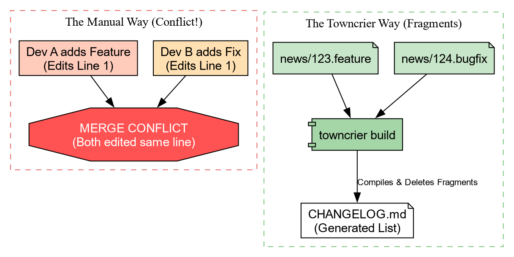
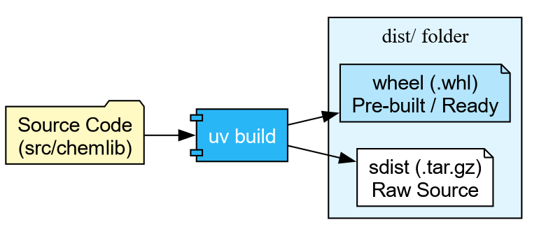
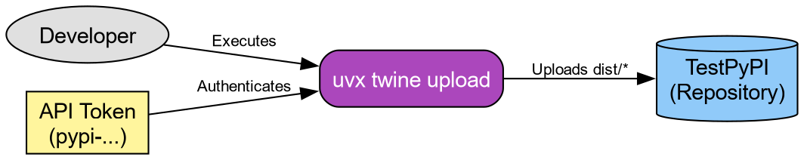

```{=org}
#+PROPERTY: header-args:bash :results output :exports both :cache yes :wrap src bash
```
---
title: "Release Engineering: Logs and Artifacts"
teaching: 25
exercises: 15
---

::: questions
-   How do I manage release notes without merge conflicts?
-   How do I publish my package to the world (safely)?
:::

::: objectives
-   Use `towncrier`{.verbatim} to manage changelogs using fragments.
-   Build package artifacts using `uv build`{.verbatim}.
-   Publish packages to TestPyPI using `uvx twine`{.verbatim}.
:::

# The Changelog Problem

Before we publish code, we need to tell our users what changed. The
naive way is to edit a `CHANGELOG.md`{.verbatim} file manually. **The
Problem:** If two people define a new feature in a Pull Request, they
both edit the top of `CHANGELOG.md`{.verbatim}. This causes **Merge
Conflicts**.

```{=org}
#+RESULTS[6ff334cf65755111435e734967c8cc777ccfe9ee]:
```


## Solution: Towncrier

**Towncrier** solves this by using "News Fragments". Instead of editing
one big file, you create a tiny file for each change.

Let's set it up.

``` bash
# Add towncrier to our dev tools
uv add --dev towncrier
```

Add the configuration to `pyproject.toml`{.verbatim}:

    [tool.towncrier]
    package = "chemlib"
    filename = "CHANGELOG.md"
    directory = "news"

Now, create the news directory:

``` bash
mkdir news
```

### Creating a News Fragment

Imagine we just added the `center_of_mass`{.verbatim} function. We
create a file in `news/`{.verbatim}. The name must end with the type of
change (`.feature`{.verbatim}, `.bugfix`{.verbatim}, `.doc`{.verbatim}).

``` bash
echo "Added center_of_mass function to geometry module." > news/1.feature
```

When we are ready to release, we run:

``` bash
uv run towncrier build --version 0.1.0
```

Towncrier will:

1.  Collect all files in `news/`{.verbatim}.
2.  Format them into a bulleted list.
3.  Prepend them to `CHANGELOG.md`{.verbatim}.
4.  Delete the fragment files.

No merge conflicts, ever!

# Building Artifacts

Now that our docs are ready, we need to package our code. Python uses
two formats:

1.  **sdist (.tar.gz):** The raw source code.
2.  **Wheel (.whl):** A pre-built, ready-to-install archive.

```{=org}
#+RESULTS[ff6cc63b07955e43a56fff3cca469220ced75d78]:
```


With `uv`{.verbatim}, building is trivial:

``` bash
uv build
```

``` example
Building source distribution...
Building wheel...
Successfully built dist/chemlib-0.1.0.tar.gz and dist/chemlib-0.1.0-py3-none-any.whl
```

# Publishing to TestPyPI

We are finally ready to ship.

```{=org}
#+RESULTS[ab7a391f9af12161a48e2f2e034cb705edbe2b21]:
```




::: callout
**Warning:** The real PyPI is permanent. For this workshop, we use
**TestPyPI** (test.pypi.org), which is a separate repository. By
default, PyPI is used for resolution.
:::

**Step 1: Get a Token**

1.  Go to [TestPyPI](https://test.pypi.org/) and create an account.
2.  Go to Settings -\> API Tokens -\> Create "Entire account" token.
3.  Copy the token (starts with `pypi-`{.verbatim}).

**Step 2: Upload using Twine** We don't need to install
`twine`{.verbatim} permanently. We can use `uvx`{.verbatim} (the tool
execution runner) to fetch and run it in one go.

``` bash
# Replace __token__ with your actual token value
uvx twine upload \
    --repository testpypi \
    --username __token__ \
    --password pypi-AgENdGVzdC5we... \
    dist/*
```

If successful, you can now see your package on the TestPyPI website, and
can be installed with

``` bash
uv pip install -i "TEST_PYPI_URL"
```

::: challenge
## Challenge: The Full Cycle

You have built the artifact. Now prove it works!

Upload your package to TestPyPI using the credentials you generated.

Create a one-line script `check_install.py`{.verbatim}:
`import chemlib; print(chemlib.file)`{.verbatim}.

Use `uv run`{.verbatim} to execute this script, but force it to install
your package from TestPyPI.

::: hint
TestPyPI is a separate "index" (a library catalog). You will need to
tell `uv`{.verbatim} where to look using the flag
`--extra-index-url https://test.pypi.org/simple/`{.verbatim}. We use
"extra" so it can still find dependencies like `numpy`{.verbatim} on the
main PyPI.
:::

::: solution
1.  Upload:

``` bash
uvx twine upload --repository testpypi dist/*
```

1.  Verify: We use `--with chemlib`{.verbatim} to request an ephemeral
    environment containing our package.

``` bash
echo "import chemlib; print('Success:', chemlib.file)" > check_install.py
uv run --extra-index-url https://test.pypi.org/simple/ --with chemlib check_install.py
```

Output:

``` example
Success: .../uv/.../site-packages/chemlib/init.py
```
:::
:::

# Automating Release (GitHub Actions)

::: caution
**Warning:** This may **not be a good idea**, since PyPI releases cannot
be removed. It is better to set this up for TestPyPI and manually use
`twine`{.verbatim} or `uv`{.verbatim} or `pdm publish`{.verbatim} and
others locally after ensuring everything works.
:::

We can teach GitHub to do this for us. We use **Trusted Publishing
(OIDC)** so we don't even need to copy-paste passwords. The CI episode
will cover GitHub Actions in full detail; for now, here is a preview of
what an automated release job looks like:

``` yaml
release:
  needs: check
  if: github.event_name == 'push' && startsWith(github.ref, 'refs/tags/v')
  runs-on: ubuntu-latest
  permissions:
    id-token: write  # Required for OIDC
    contents: read

  steps:
    - uses: actions/checkout@v4
    - uses: astral-sh/setup-uv@v5

    - name: Build
      run: uv build

    - name: Publish to TestPyPI
      uses: pypa/gh-action-pypi-publish@release/v1
      with:
        repository-url: https://test.pypi.org/legacy/
        # No password needed if configured in PyPI settings!
```

Now, whenever you push a tag (e.g., `v0.1.0`{.verbatim}), GitHub will
build and ship your code automatically.

::: keypoints
-   **Towncrier** prevents changelog conflicts by using "News
    Fragments".
-   **uv build** creates standard `sdist`{.verbatim} and
    `wheel`{.verbatim} artifacts.
-   **uvx twine** allows one-off publishing without polluting your
    environment.
-   **TestPyPI** is the sandbox for practicing release engineering.
:::
